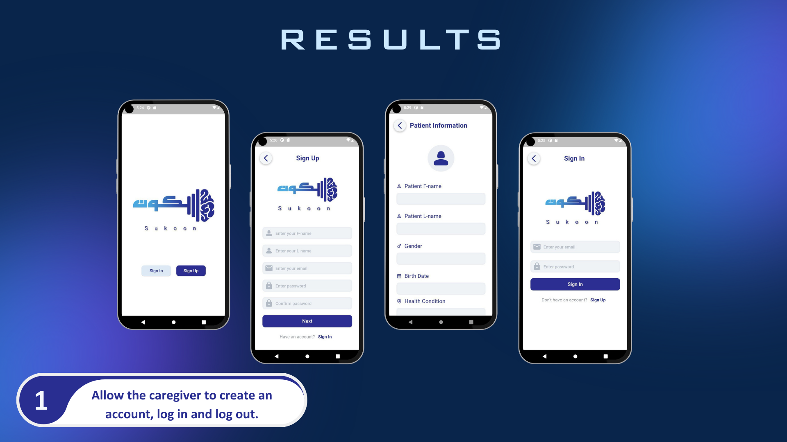
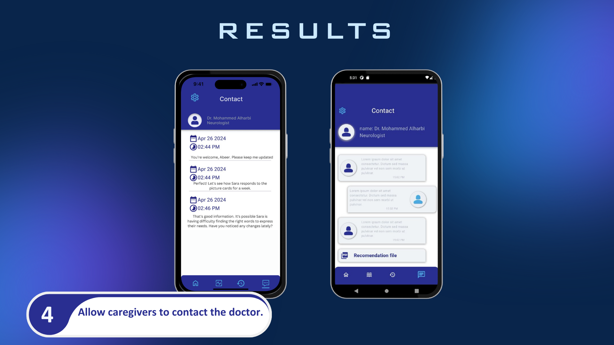
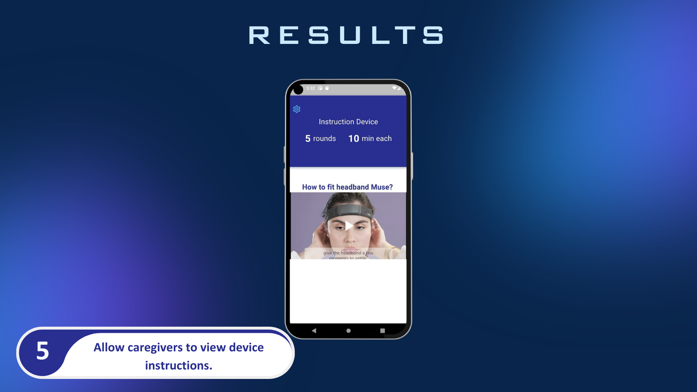
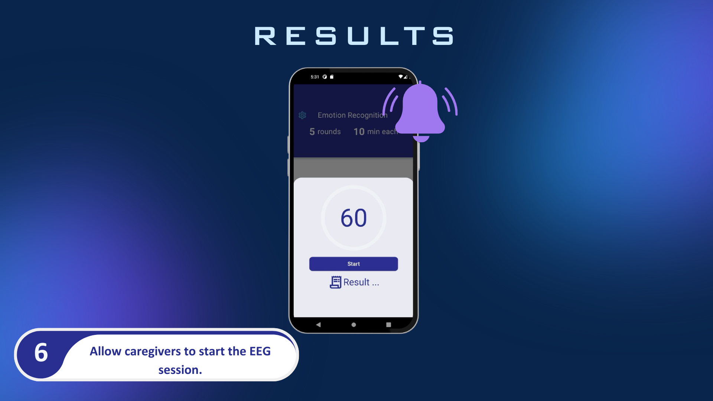
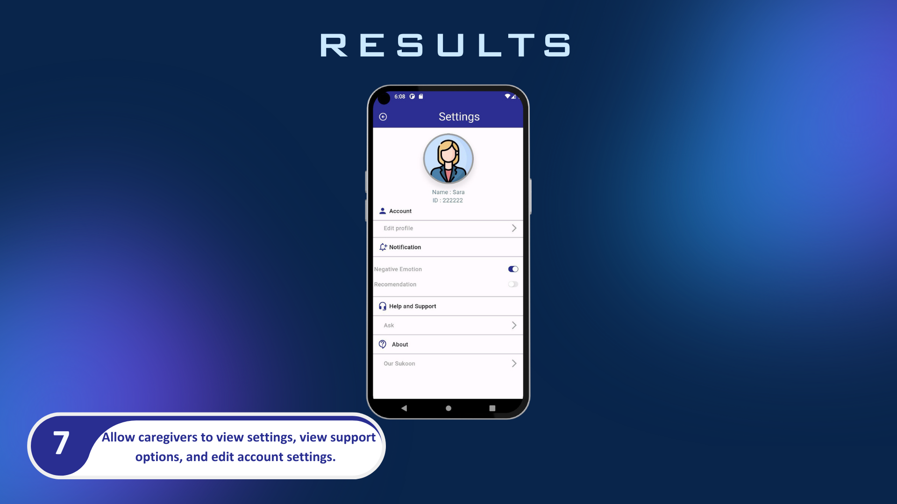

# Sukoon

A system that reads brain signals of patients through MUSE, translating them into understandable emotions for healthcare providers, enhancing communication and care for individuals unable to express their needs.

**Sukoon** is an innovative solution designed to assist individuals who face challenges in expressing their emotions and needs, such as those with complete paralysis and an inability to speak. The system uses brain signals, read through the MUSE device, and translates them into understandable emotions for healthcare providers.

## Features

- **Brain Signal Translation**: Converts brain signals into emotions using the MUSE device.
- **Dedicated Application**: Provides a platform for healthcare providers to understand patients' needs in real-time.
- **Doctor Consultation Website**: Allows caregivers to consult doctors remotely, and for doctors to access patient data and medical history.
- **Improves Communication and Care**: Enhances the quality of life for patients by enabling effective communication with caregivers and healthcare providers.

## Getting Started

### Prerequisites

- A MUSE device for capturing brain signals.
- Access to the Sukoon application.
- Internet connection for remote consultations.
- MindMonitor Application

[Watch the video on YouTube](https://www.youtube.com/watch?v=kxpMquB86Bw)

